## Getting Started with Ballroom

Welcome to the "Ballroom" platform! This guide will walk you through the essential steps to get started and make the most of your experience.

### Administrator's Guide: Creating Contests and Challenges

#### Section 1: Setup account

If you're new to Ballroom, start by signing up for an account. If you already have an account, simply log in by clicking the sign-in button on the home page.

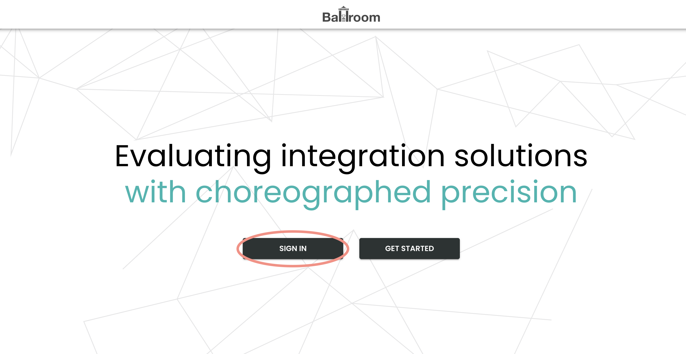

You will redirected to the Asgardeo login page. If you already have an account, you can simply log in by passing a username and password or create a new account by following the steps.

#### Section 2: Change to the Administrator role

Once you log in, go to the profile page by clicking on the profile at the top right corner. On the profile page, click on the "USE AS AN ADMIN" button to change the role to administrator. If you are already an admin, you can skip this section.

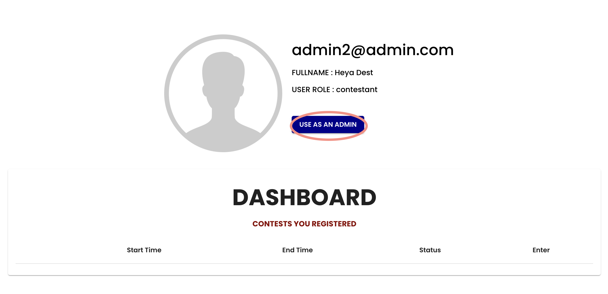

#### Section 3: Dashboard Overview

Upon logging in, you'll arrive at the administrator dashboard. This is where you'll manage contests, challenges, and participant interactions.

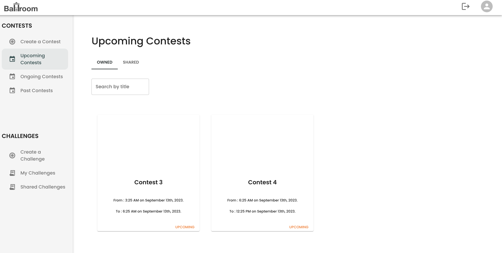

#### Section 4: Create a Contest

Navigate to the `Contests` section and click on "Create a Contest" Fill in contest details, such as title, description, banner, start time, and end time as shown below,

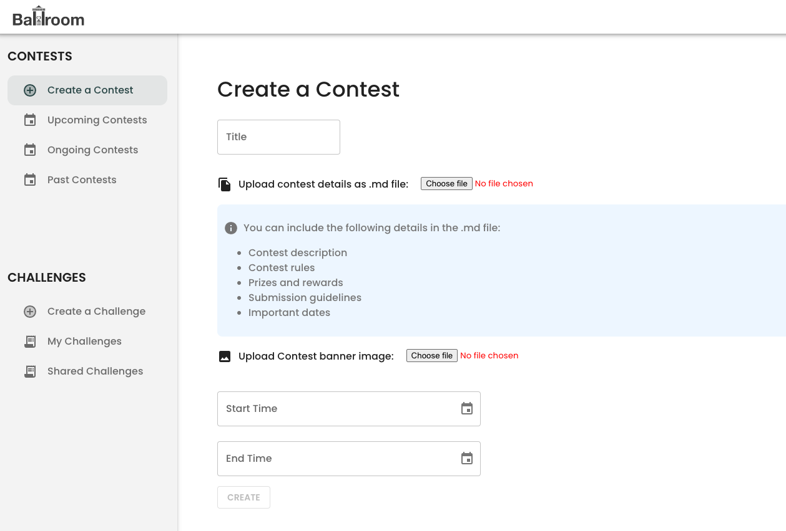

* Title - You can specify any name for the contest. We recommending to give a meaningful title for the contest.
* Contest details - You can update the .md file with the contest details. The following sections can be included in the file.
    * Contest description
    * Contest rules
    * Prizes and rewards
    * Submission guidelines
    * Important dates

    > Refer to the sample [description file](https://github.com/Ballroom-Platform/ballroom-backend/blob/m2/TestData/contestdes.md) for more details.

* Contest banner - You can upload a banner for your contest.
* Start time - Set a starting time for the contest
* End time - Set an ending time for the contest

Once you create a contest, it will listed in the Upcoming or Ongoing contest depending on the starting time you set in the contest.

#### Section 5: Create a Challenge

You can create a challenge separately and attach it to the contest. So the same challenge can attach to one or many contests. Define the challenge name, difficulty, readme file with description, project template as a zip file, and evaluation test cases as a zip file as shown below,

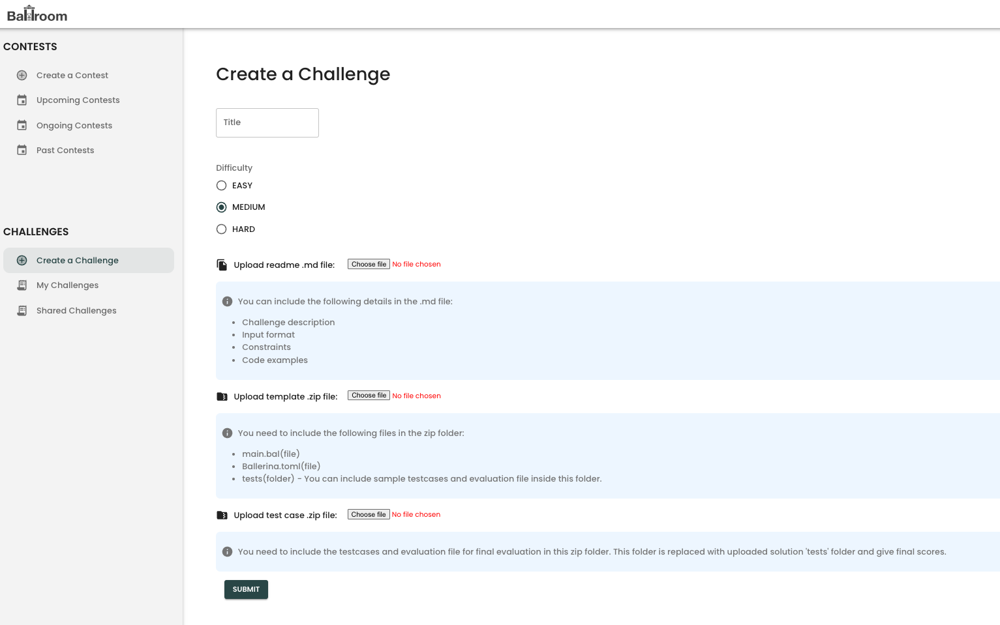

* Title - You can specify any name for the contest. We recommending to give a meaningful title for the challenge.
* Challenge details - You can update the .md file with the challenge details. The following sections can be included in the file.
    * Challenge description
    * Input format
    * Constraints
    * Code examples

	> Refer to the sample [description file](https://github.com/Ballroom-Platform/ballroom-backend/blob/m2/TestData/challengedes.md) for more details.

* Project template - Upload the Ballerina project template in which the contestant writes the integration logic for the challenge. The contestant can download the zip file and open it in VSCode.
    > Refer to the sample [template zip file](https://github.com/Ballroom-Platform/ballroom-backend/blob/m2/TestData/TemplateFile.zip).

* Evaluation test cases - You need to include the test cases and evaluation file for the final evaluation in this zip folder. This folder is replaced with the uploaded solution 'tests' folder and gives final scores.

	> Refer to the sample [template zip file](https://github.com/Ballroom-Platform/ballroom-backend/blob/m2/TestData/testcase.zip).

Once you create a challenge, it will listed in the "My Challenges" section. You can attach the challenge to a contest.

#### Section 6: Attach a Challenge to a Contest

​​After creating challenges, go to the contest details page of an upcoming contest. In the contest details page, go to the "ADD CHALLENGE" tab where you can search for challenges and add challenges to the contest as below,

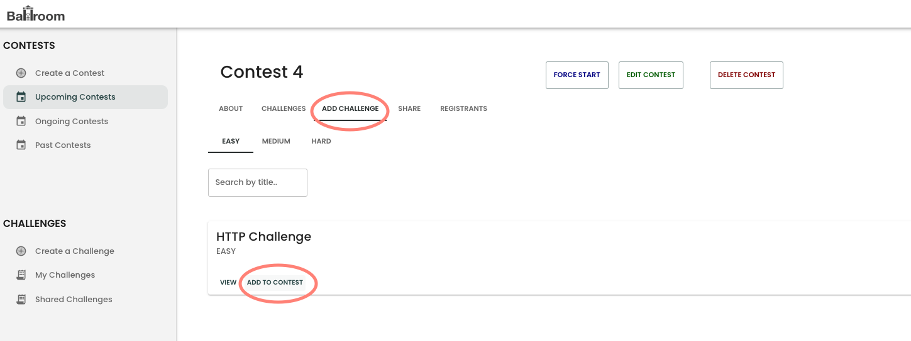

#### Section 6: Share the contest with another administrator

Go to the contest details page which you need to share with another admin, select the `SHARE` tab, and search for the user you need to share within the user tab. Click on "add user" and the system will share the contest with others. You can also view the already shared list in the other tab.

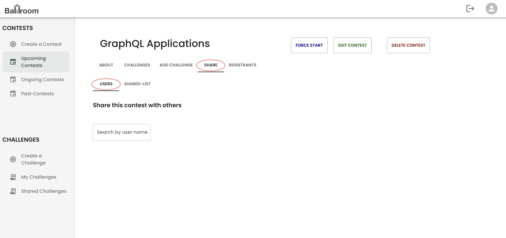

#### Section 7: Share the challenge with another administrator

Go to the challenge details page which you need to share with another admin, select the `SHARE` tab, and search for the user you need to share within the user tab. Click on "add user" and the system will share the challenge with others. You can also view the already shared list in the other tab.

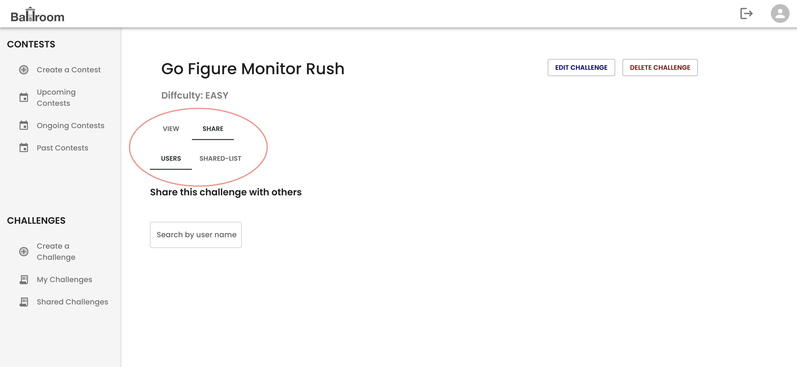

#### Section 8: View/Manage the contest

* View the contest details by clicking on the contest card in the dashboard as shown below,

    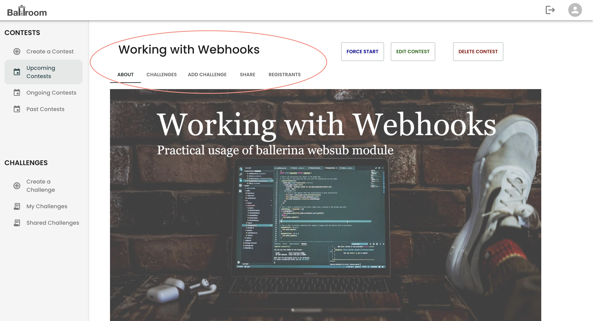

* Start/edit/delete the contest anytime by clicking the respect button on the contest detail page as shown below,

    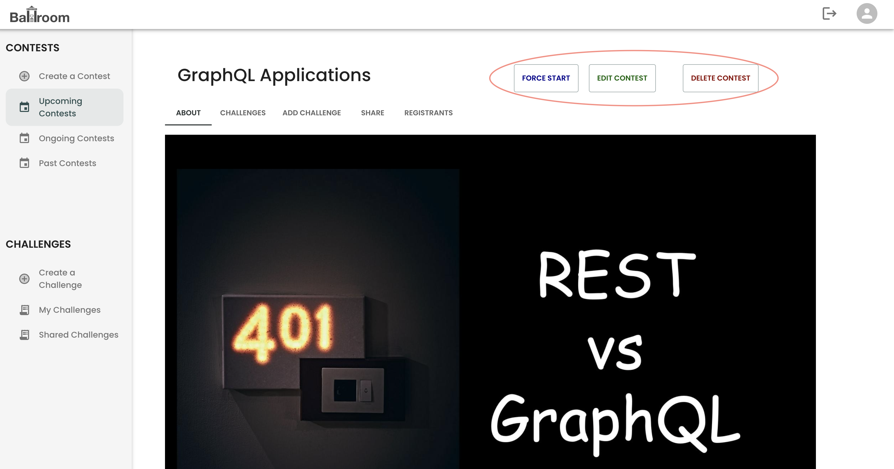

* Update the contest details in the "Edit Contest" page as shown below,

    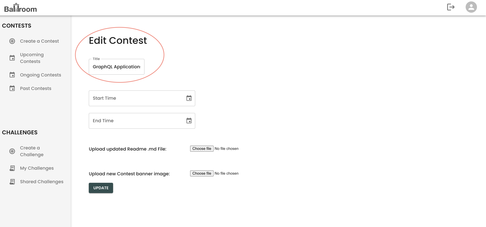

* View the Leaderboard of the ongoing and ended contests

    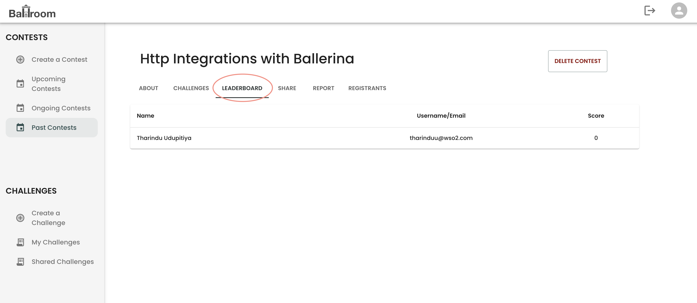

### Contestant's Guide: Participating in a Contest

#### Section 1: Account Setup
If you're new to Ballroom, start by signing up for an account. If you already have an account, simply log in by clicking the sign-in button on the home page.

You will redirected to the Asgardeo login page. If you already have an account, you can simply log in by passing a username and password or create a new account by following the steps.

#### Section 2: Exploring Contests
Browse available contests in the "Contests" section. Choose a contest that aligns with your interests and skills.

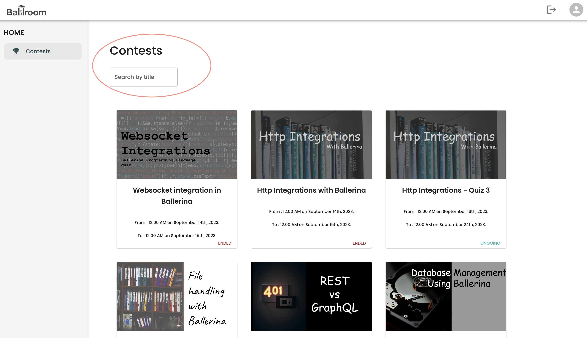

#### Section 3: Registering to a Contest
Select a contest and click "Register" to participate as shown below. You can register for multiple contests.

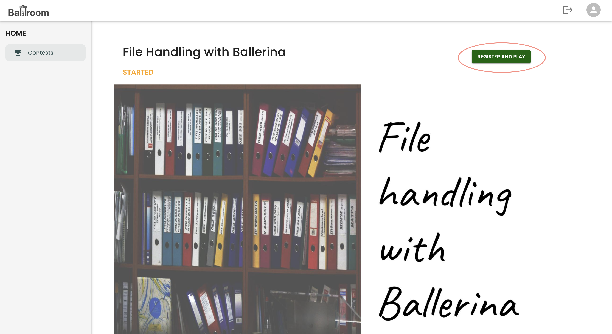

#### Section 4: Selecting a Challenge
Inside the contest, review the list of challenges. Choose a challenge that piques your interest and click to access details.

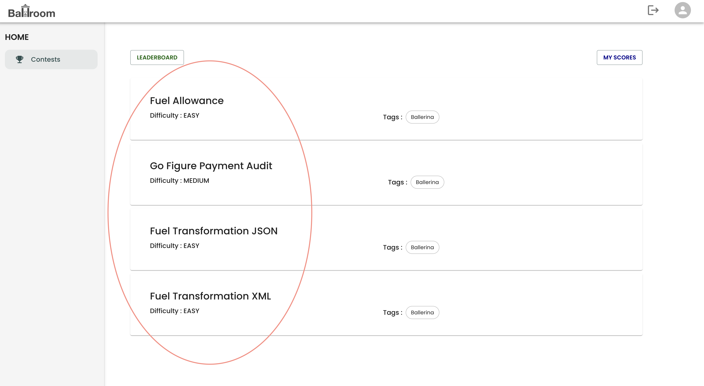

#### Section 5: Working on the Challenge
Study the challenge description, criteria, and integration requirements. Understand what's expected for successful completion. And then begin working on the challenge by downloading the provided template and opening it in VSCode.

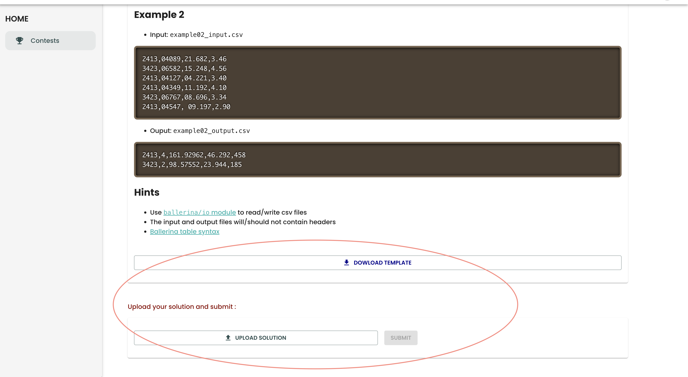

Implement the integration logic in the template and test it locally. Once you're satisfied with the solution, upload it to the Ballroom platform.

#### Submitting Your Solution
Once your solution is ready, submit it by following the provided submission instructions. Upload the solution zip file and click "Submit".

#### Monitoring Progress
After submitting, monitor your progress on the real-time leaderboard. See how your scores compare to other participants.

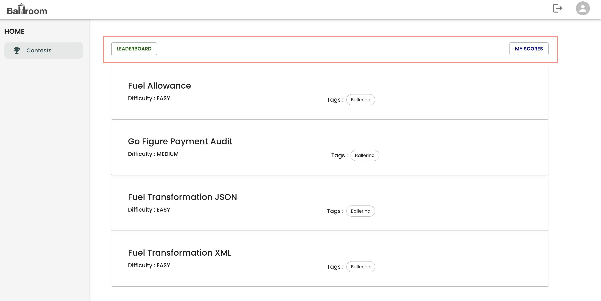

